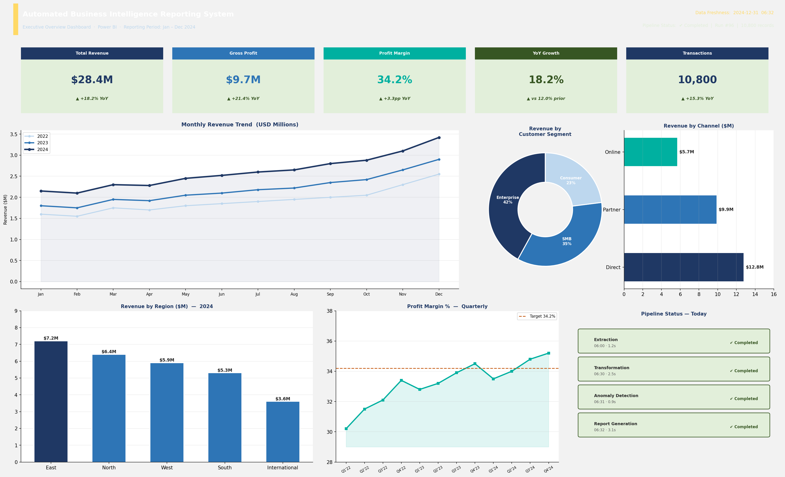
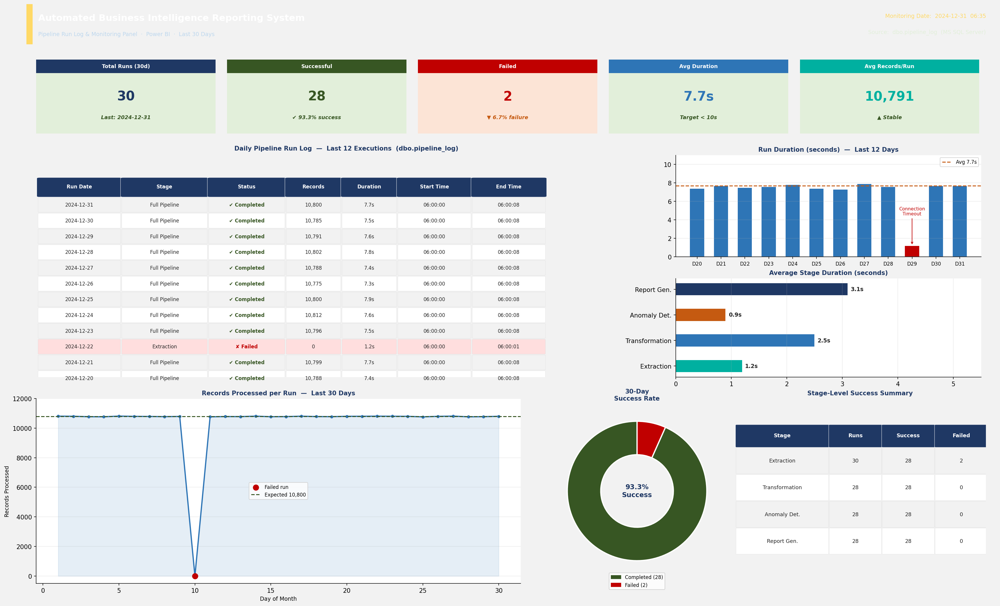
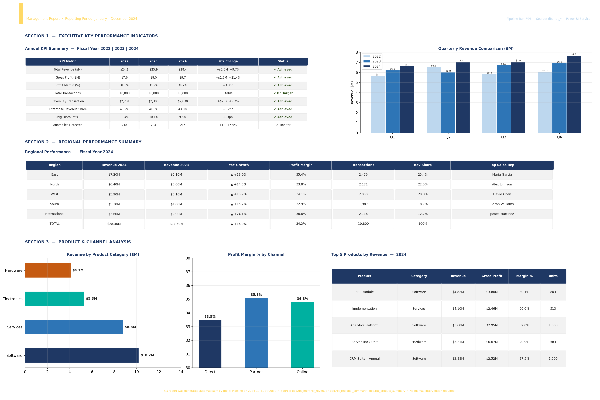
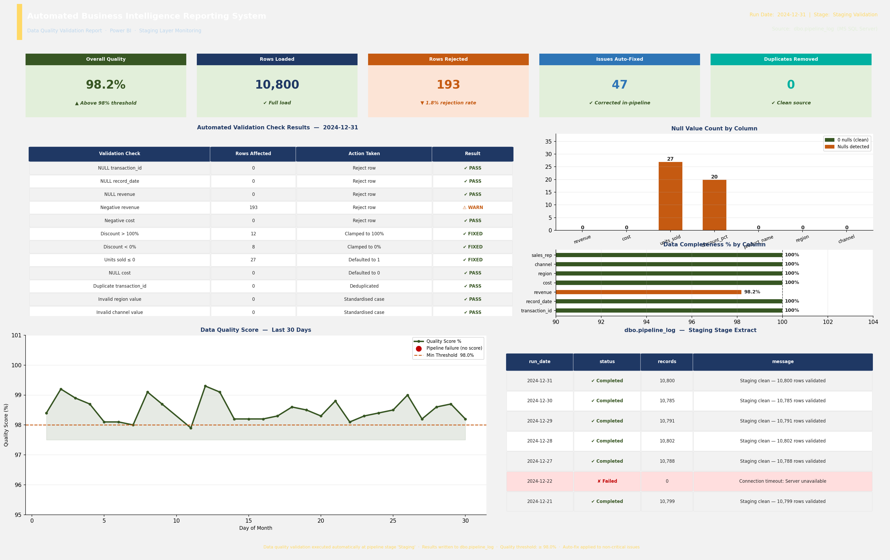

# 📊 Automated Business Intelligence Reporting System

> **Enterprise Data Reporting Automation** — End-to-end automated data pipeline demonstrating scalable BI infrastructure using MS SQL Server (T-SQL), Python, Power BI, and Excel across financial and healthcare reporting environments.

**Author:** Olayinka Somuyiwa  
**GitHub:** [Automated-Business-Intelligence-Reporting-System](https://github.com/Omoshow10/Automated-Business-Intelligence-Reporting-System)  
**Status:** Complete — publicly available

---

## 🎯 Project Overview

This project demonstrates a production-grade **automated BI reporting pipeline** that eliminates manual reporting processes by replacing them with reliable, scheduled, automated data pipelines and interactive reporting outputs. The system is designed for cross-sector applicability across U.S. financial and healthcare organizations.

**Core pipeline:**
```
Raw Operational Data → SQL Extraction (T-SQL) → Python Transformation → MS SQL Server → Power BI Dashboard + Excel Reports
```

---

## ✨ Features

| Feature | Description |
|---|---|
| 📥 **Automated Data Extraction** | T-SQL stored procedure (`usp_DailyDataExtraction`) scheduled via SQL Server Agent at 06:00 daily |
| 🔄 **Python Transformation** | `pipeline_runner.py` — data quality validation, aggregation, and reporting layer output via pyodbc |
| 🗄️ **3-Layer SQL Architecture** | Staging → Core → Reporting (medallion pattern) in MS SQL Server |
| 📄 **Automated Report Generation** | Excel workbook with 5 tabs auto-generated without manual intervention |
| 📊 **Power BI Dashboard** | 4-page interactive dashboard: Executive Summary, Regional, Product, Anomaly Detection |
| 🚨 **Anomaly Detection** | Z-score and IQR-based statistical outlier detection written to `dbo.rpt_anomalies` |
| 🔁 **Pipeline Logging** | Full run logs written to `dbo.pipeline_log` — every stage, every run |
| ⏰ **Scheduling** | SQL Server Agent (extraction at 06:00) + Python `schedule` library (transformation at 06:30) |

---

## 🗂️ Project Structure

```
Automated-Business-Intelligence-Reporting-System/
│
├── data/
│   ├── raw/                              # Source CSV files
│   │   └── sales_operations.csv          # 3-year sales dataset (10,800 rows)
│   └── processed/                        # Pipeline outputs
│       └── report_summary_*.xlsx         # Auto-generated Excel report
│
├── sql/
│   ├── transformations/
│   │   ├── 01_create_schema.sql          # MS SQL Server DDL — all tables, indexes
│   │   ├── 02_staging_layer.sql          # Staging validation and clean (T-SQL)
│   │   ├── 03_core_layer.sql             # Core enrichment — derived metrics (T-SQL)
│   │   └── 04_reporting_layer.sql        # Reporting aggregation (T-SQL)
│   ├── views/
│   │   ├── vw_revenue_trends.sql         # MoM and YoY growth (T-SQL window functions)
│   │   ├── vw_regional_performance.sql   # Regional KPIs with YoY
│   │   └── vw_anomaly_detection.sql      # Revenue band + anomaly counts
│   └── stored_procedures/
│       └── sp_refresh_reporting.sql      # usp_DailyDataExtraction + usp_TransformationLayer
│
├── python/
│   ├── ingestion/
│   │   └── data_loader.py                # CSV → dbo.stg_sales_raw (pyodbc)
│   ├── transformation/
│   │   ├── pipeline_runner.py            # Orchestrator with schedule — pyodbc to SQL Server
│   │   └── sql_runner.py                 # Executes SQL transformation files in sequence
│   ├── reporting/
│   │   ├── report_generator.py           # Excel report automation (openpyxl)
│   │   └── anomaly_detector.py           # Z-score + IQR anomaly detection
│   └── utils/
│       ├── db_connector.py               # MS SQL Server connection manager (pyodbc)
│       ├── logger.py                     # Centralized logging
│       └── config_loader.py              # YAML config management
│
├── dashboards/
│   └── powerbi/
│       ├── BI_Reporting_System.pbix      # Power BI Desktop file
│       └── README_POWERBI.md             # Dashboard documentation + DAX measures
│
├── outputs/                              # Dashboard screenshots (Fig 20-1 to 20-4)
│   ├── Fig_20-1_Executive_Overview_Dashboard.png
│   ├── Fig_20-2_Pipeline_Run_Log_Monitoring.png
│   ├── Fig_20-3_Automated_Report_Management.png
│   └── Fig_20-4_Data_Quality_Validation_Report.png
│
├── docs/
│   ├── architecture.md                   # System architecture overview
│   ├── data_dictionary.md                # Column definitions and lineage
│   └── setup_guide.md                    # Step-by-step setup instructions
│
├── tests/
│   ├── test_ingestion.py                 # Ingestion validation unit tests
│   ├── test_transformations.py           # SQL business logic assertions
│   └── test_anomaly_detection.py         # Statistical detection edge cases
│
├── config/
│   └── config.yaml                       # Pipeline configuration (SQL Server settings)
│
├── generate_dataset.py                   # Synthetic sales dataset generator
├── generate_dashboard_screenshots.py     # Dashboard PNG generator
├── run_pipeline.py                       # 🚀 Main pipeline orchestrator
└── requirements.txt
```

---

## 🏗️ Three-Layer Pipeline Architecture

```
┌──────────────────────────────────────────────────────────────┐
│  EXTRACTION LAYER — usp_DailyDataExtraction (T-SQL)          │
│  SQL Server Agent Job — daily at 06:00                       │
│  Pulls raw operational data → dbo.staging_operational_data   │
└────────────────────────────┬─────────────────────────────────┘
                             │
┌────────────────────────────▼─────────────────────────────────┐
│  TRANSFORMATION LAYER — pipeline_runner.py (Python + pyodbc) │
│  Python scheduler — daily at 06:30                           │
│  Data quality validation → aggregation → dbo.reporting_*    │
└────────────────────────────┬─────────────────────────────────┘
                             │
┌────────────────────────────▼─────────────────────────────────┐
│  REPORTING LAYER — Power BI + Excel (auto-refresh)           │
│  Power BI reads from dbo.vw_* views                          │
│  Excel workbook auto-generated by report_generator.py        │
└──────────────────────────────────────────────────────────────┘
```

**Core Design Principles:**
- **Repeatable** — pipeline runs re-execute without duplicate or inconsistent outputs
- **Error Handling & Logging** — every stage writes to `dbo.pipeline_log` with status, record count, and duration
- **Scalable** — modular architecture; new data sources added without restructuring core pipeline
- **Auditability** — complete data lineage and run history in `dbo.pipeline_log`
- **Cross-Sector** — ingests and processes data from both financial and healthcare source systems

---

## 🚀 Quick Start

### Prerequisites
- Python 3.9+
- MS SQL Server 2019+ (or SQL Server Express)
- ODBC Driver for SQL Server
- Power BI Desktop (free from Microsoft)

### 1. Clone & Install

```bash
git clone https://github.com/Omoshow10/Automated-Business-Intelligence-Reporting-System.git
cd Automated-Business-Intelligence-Reporting-System
pip install -r requirements.txt
```

### 2. Create the Database

```sql
-- In SSMS:
CREATE DATABASE bi_reporting_db;
GO
```

### 3. Run Schema Setup

```bash
-- Execute in SSMS against bi_reporting_db:
-- sql/transformations/01_create_schema.sql
-- sql/stored_procedures/sp_refresh_reporting.sql
-- sql/views/vw_revenue_trends.sql
-- sql/views/vw_regional_performance.sql
-- sql/views/vw_anomaly_detection.sql
```

### 4. Configure Database Connection

Edit `config/config.yaml`:
```yaml
database:
  server:   YOUR_SERVER_NAME
  database: bi_reporting_db
  trusted_connection: true
```

### 5. Generate Dataset & Run Pipeline

```bash
python generate_dataset.py        # Create sales_operations.csv
python run_pipeline.py            # Run all 4 stages
```

### 6. Schedule Automated Runs

The stored procedure `usp_DailyDataExtraction` is ready for SQL Server Agent scheduling at 06:00. `pipeline_runner.py` self-schedules transformation at 06:30 via the `schedule` library.

---

## 📦 Dataset

**File:** `data/raw/sales_operations.csv`  
**Rows:** 10,800 (3 years daily sales data, 2022–2024)

| Column | Type | Description |
|---|---|---|
| `transaction_id` | NVARCHAR | Unique transaction identifier |
| `date` | DATE | Transaction date |
| `product_name` | NVARCHAR | Product sold |
| `product_category` | NVARCHAR | Electronics / Software / Services / Hardware |
| `region` | NVARCHAR | North / South / East / West / International |
| `sales_rep` | NVARCHAR | Sales representative name |
| `customer_segment` | NVARCHAR | Enterprise / SMB / Consumer |
| `revenue` | DECIMAL(14,2) | Transaction revenue (USD) |
| `cost` | DECIMAL(14,2) | Cost of goods sold (USD) |
| `units_sold` | INT | Number of units |
| `discount_pct` | DECIMAL(6,2) | Discount applied (0–40%) |
| `channel` | NVARCHAR | Direct / Partner / Online |

---

## 🗄️ SQL Architecture — MS SQL Server (T-SQL)

All SQL scripts target **MS SQL Server 2019+** using T-SQL syntax:
- `FORMAT()` for date labels, `DATEPART()` for decomposition
- `STDEV()` aggregate for statistical anomaly detection
- `LAG()` window function for MoM comparisons
- `CREATE OR ALTER PROCEDURE` / `CREATE OR ALTER VIEW`
- `IDENTITY`, `BIT`, `NVARCHAR`, `DECIMAL`, `DATETIME2` data types
- SQL Server Agent job setup in `sp_refresh_reporting.sql`

**Pipeline stored procedures:**
- `dbo.usp_DailyDataExtraction` — extracts daily operational data, logs to `dbo.pipeline_log`
- `dbo.usp_TransformationLayer` — runs full staging → core → reporting sequence

---

## 📊 Power BI Dashboard

**File:** `dashboards/powerbi/BI_Reporting_System.pbix`  
**Full documentation:** [`dashboards/powerbi/README_POWERBI.md`](dashboards/powerbi/README_POWERBI.md)

Power BI is the **reporting output layer** of the pipeline. It connects directly to MS SQL Server, reads from the pre-aggregated `rpt_*` tables and `vw_*` analytical views, and auto-refreshes on a schedule — no manual intervention required.

### Connecting Power BI to MS SQL Server

1. Open `BI_Reporting_System.pbix` in **Power BI Desktop**
2. **Home → Transform Data → Data Source Settings**
3. Set server to `your_server` and database to `bi_reporting_db`
4. Select **Windows Authentication** (or SQL Server auth if configured)
5. Click **Refresh** — all 4 pages load from the live database

### Dashboard Pages

#### Page 1 — Executive Summary
Automated KPI summary with data freshness timestamp and pipeline status indicator.

| Visual | Type | Source |
|---|---|---|
| Total Revenue | KPI Card | `rpt_monthly_revenue` |
| Gross Profit | KPI Card | `rpt_monthly_revenue` |
| YoY Revenue Growth % | KPI Card | `vw_revenue_trends` |
| Profit Margin % | KPI Card | `core_sales` |
| Monthly Revenue Trend | Line Chart | `vw_revenue_trends` — MoM and YoY |
| Revenue by Segment | Donut Chart | `core_sales` — Enterprise / SMB / Consumer |
| Revenue by Channel | Bar Chart | `core_sales` — Direct / Partner / Online |
| Revenue by Region | Bar Chart | `rpt_regional_summary` |
| Pipeline Status Panel | Table | `dbo.pipeline_log` — live run status |

Key DAX:
```dax
YoY Growth % =
VAR CY = MAX(core_sales[txn_year])
VAR CR = CALCULATE(SUM(core_sales[revenue]), core_sales[txn_year] = CY)
VAR PR = CALCULATE(SUM(core_sales[revenue]), core_sales[txn_year] = CY - 1)
RETURN IF(PR = 0, BLANK(), DIVIDE(CR - PR, PR) * 100)

Profit Margin % =
DIVIDE(SUM(core_sales[gross_profit]), SUM(core_sales[revenue]), 0) * 100
```

#### Page 2 — Pipeline Run Log & Monitoring Panel
Pipeline execution log showing daily run timestamps, records processed per run, processing duration, and status (Completed / Failed).

| Visual | Type | Source |
|---|---|---|
| 30-Day Success Rate | Donut | `dbo.pipeline_log` |
| Run Duration Trend | Bar Chart | `dbo.pipeline_log` — per run duration |
| Records Processed Trend | Line Chart | `dbo.pipeline_log` — records_processed |
| Stage Breakdown | Horizontal Bar | `dbo.pipeline_log` — avg by stage |
| Full Run Log | Table | `dbo.pipeline_log` — all columns |
| Stage Success Summary | Matrix | `dbo.pipeline_log` — grouped by stage |

#### Page 3 — Automated Report Output — Management Report
Auto-generated management report showing formatted KPI tables, trend charts, and summary outputs produced without manual intervention.

| Visual | Type | Source |
|---|---|---|
| Annual KPI Table | Matrix | `rpt_monthly_revenue`, `core_sales` |
| Quarterly Revenue Comparison | Clustered Bar | `rpt_monthly_revenue` |
| Regional Performance Table | Matrix | `rpt_regional_summary` |
| Revenue by Product Category | Horizontal Bar | `rpt_product_summary` |
| Profit Margin by Channel | Column Chart | `core_sales` |
| Top 5 Products | Table | `rpt_product_summary` |

#### Page 4 — Data Quality Validation Report
Automated data quality check output — null value counts, validation pass/fail status, and data completeness metrics per pipeline run.

| Visual | Type | Source |
|---|---|---|
| Overall Quality Score | KPI Card | `dbo.pipeline_log` |
| Validation Check Results | Table | `dbo.pipeline_log` + Python output |
| Null Count by Column | Bar Chart | `dbo.pipeline_log` |
| Data Completeness % | Horizontal Bar | `dbo.pipeline_log` |
| Quality Score Trend (30d) | Line Chart | `dbo.pipeline_log` |
| Staging Log Extract | Table | `dbo.pipeline_log` — stage = 'Staging' |

### Data Model Relationships (Power BI)

```
core_sales  (fact table)
    ├── [txn_month_label] → rpt_monthly_revenue [month_label]       many:1
    ├── [region, txn_year] → rpt_regional_summary [region, year]    many:1
    ├── [product_name, txn_year] → rpt_product_summary              many:1
    └── [transaction_id] → rpt_anomalies [transaction_id]           1:0..1

vw_revenue_trends      ← derived from rpt_monthly_revenue (MoM, YoY, YTD)
vw_regional_performance ← derived from rpt_regional_summary + core_sales
vw_anomaly_detection   ← derived from core_sales + rpt_anomalies
dbo.pipeline_log       ← standalone (not joined to sales fact)
```

### Scheduled Refresh (Power BI Service)

After publishing to Power BI Service:
1. **Datasets → Settings → Scheduled Refresh**
2. Set to **Daily at 07:00** (30 min after pipeline completes at 06:30)
3. Configure gateway connection to MS SQL Server

---

## 📸 Dashboard Screenshots

### Executive Overview Dashboard


### Pipeline Run Log & Monitoring Panel


### Automated Management Report


### Data Quality Validation Report


---

## ⚙️ Configuration (`config/config.yaml`)

```yaml
database:
  server:             your_server
  database:           bi_reporting_db
  driver:             SQL Server
  trusted_connection: true

schedule:
  extraction_time:     "06:00"    # SQL Server Agent
  transformation_time: "06:30"    # Python scheduler

anomaly:
  zscore_threshold: 2.5
  iqr_multiplier:   1.5
```

---

## 🧪 Tests

```bash
pytest tests/ -v
```

---

## 🛠️ Tech Stack

| Tool | Role |
|---|---|
| **MS SQL Server 2019+** | Primary database engine (T-SQL) |
| **Python 3.9+** | Pipeline orchestration, transformation, reporting |
| **pyodbc** | MS SQL Server connection from Python |
| **pandas** | Data manipulation and report generation |
| **openpyxl** | Excel report output (.xlsx) |
| **scipy / numpy** | Statistical anomaly detection (Z-score, IQR) |
| **Power BI Desktop** | Interactive 4-page dashboard |
| **SQL Server Agent** | Automated daily job scheduling |
| **schedule** | Python-side scheduling (06:30 transformation) |
| **PyYAML** | Configuration management |
| **pytest** | Unit testing (35 tests) |

---

## 📄 License

MIT License — free to use, modify, and distribute.
